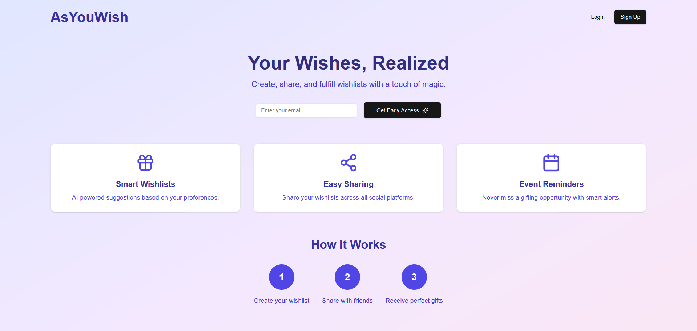
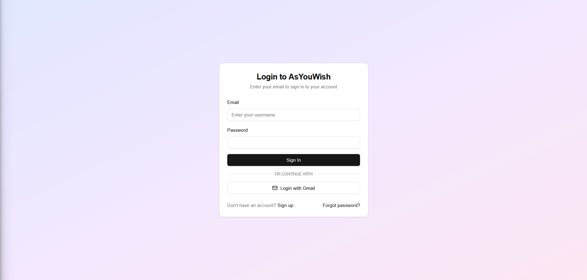
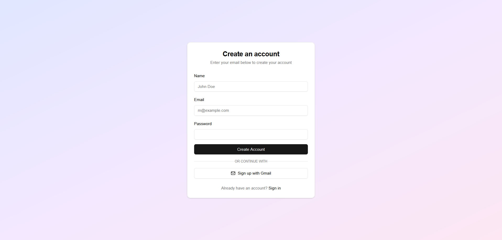
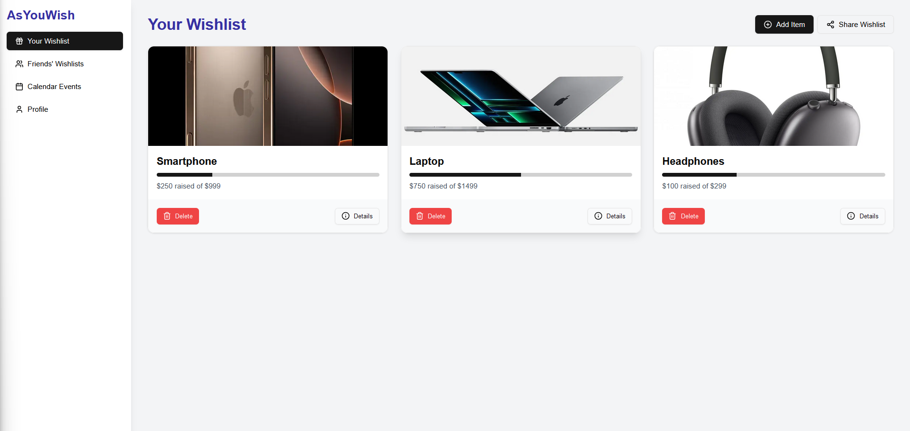
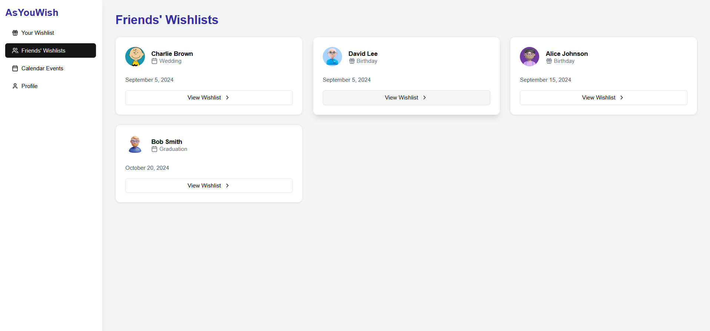
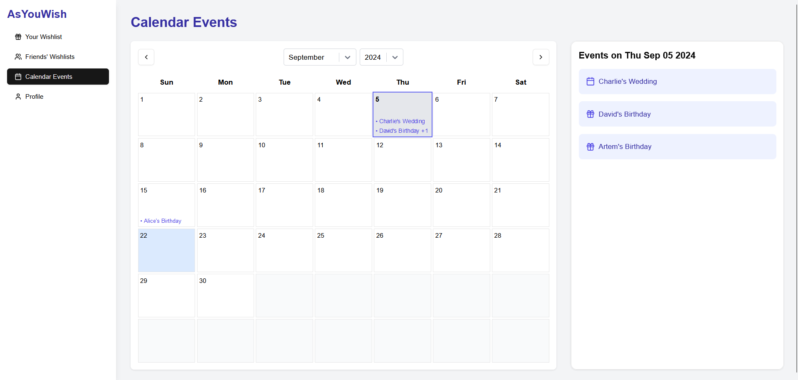

MVP for Agile

## Getting Started

First, run the development server:

```
npm run dev
```

Open [http://localhost:3000](http://localhost:3000) with your browser to see the result.

## Main Page


## Login Page


## Sign up Page


## Your Wishlist Page


## Friends Wishlist Page


## Calendar Page <- need improvement
